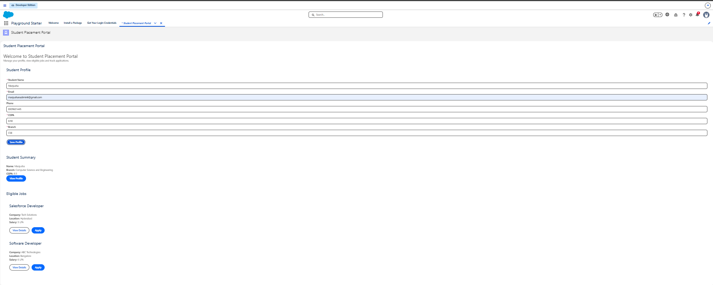
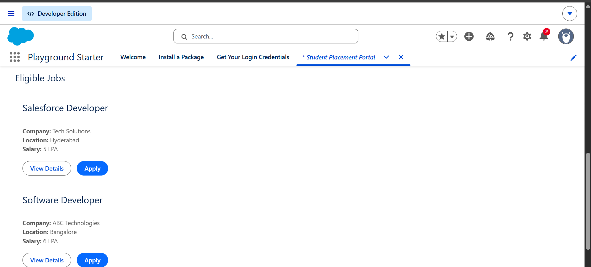
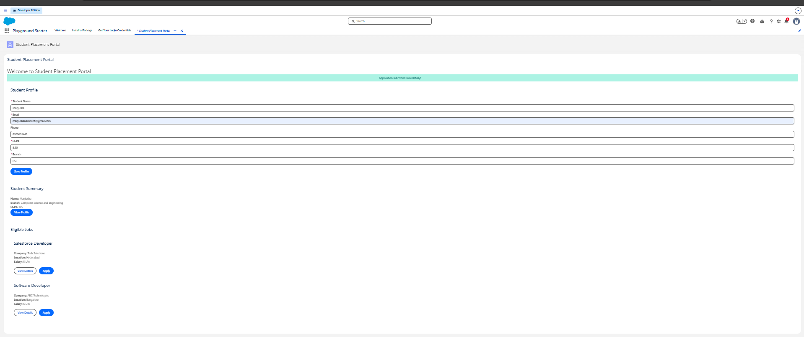
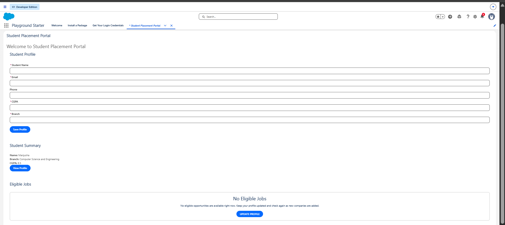

# Sprint 10 – LWC Architecture & Component Communication

## Student Placement Portal

Sprint 10 extends the Student Placement Portal into a component-based Lightning Web Component (LWC) application.

The main focus of this sprint was to understand how multiple LWCs work together through **parent-to-child communication, child-to-parent communication, custom events, reusable components, form handling, validation, and consistent UI states**.

---

## Component Tree

The current component structure is:

```text
StudentPortal
│
├── StudentSummary
│
├── StudentProfile
│
└── EligibleJobs
    │
    ├── JobCard
    │
    └── EmptyState
```

### Component Responsibilities

| Component        | Responsibility                                              |
| ---------------- | ----------------------------------------------------------- |
| `StudentPortal`  | Parent component that coordinates the portal                |
| `StudentSummary` | Displays student information and reports profile actions    |
| `StudentProfile` | Displays and validates student profile form data            |
| `EligibleJobs`   | Displays eligible job opportunities                         |
| `JobCard`        | Displays an individual job and reports user actions         |
| `EmptyState`     | Displays a meaningful message when no records are available |

The components are intentionally separated so that each component has a clear responsibility instead of putting all functionality into one large component.

---

## Communication

### Parent → Child

The parent can pass information to a child using public properties with `@api`.

For example, `StudentSummary` exposes:

```javascript
@api studentName;
@api branch;
@api cgpa;
```

This allows the parent component to provide student information to the summary component.

Similarly, `JobCard` receives a job through:

```javascript
@api job;
```

The child focuses on displaying the information it receives.

---

### Child → Parent

Child components communicate with their parents using **Custom Events**.

`JobCard` dispatches events when the user wants to view details or apply:

```javascript
this.dispatchEvent(
    new CustomEvent('viewdetails', {
        detail: {
            jobId: this.job.id
        }
    })
);
```

and:

```javascript
this.dispatchEvent(
    new CustomEvent('apply', {
        detail: {
            jobId: this.job.id
        }
    })
);
```

`EligibleJobs` receives these events and forwards the relevant information to its parent.

The communication flow is:

```text
JobCard
   │
   │ viewdetails / apply
   ▼
EligibleJobs
   │
   │ viewdetails / apply
   ▼
StudentPortal
```

The child does not directly modify the parent's state.

### Engineering Principle

> Children report events. Parents coordinate behaviour.

This keeps the components loosely coupled and easier to maintain.

---

## Data Strategy

The current Sprint 10 implementation uses local component state for the demonstrated UI behaviour.

### Current implementation

* `EligibleJobs` currently uses a local JavaScript `jobs` array for demonstration.
* `StudentProfile` maintains form values in component state.
* `StudentSummary` receives student information through `@api`.
* `JobCard` receives job information through `@api`.
* Custom events are used to communicate user actions between components.

### LDS / Wire / Apex

The architecture is designed so that Salesforce data services can be introduced where appropriate.

For record-based operations, **Lightning Data Service (LDS)** is preferable when the requirement can be handled by Salesforce's standard record APIs.

Custom Apex is appropriate when the application requires:

* Complex business logic
* Custom server-side processing
* Queries or operations not suitable for LDS
* Business validation that must be enforced on the server

The implementation should choose the simplest platform capability that satisfies the requirement rather than using Apex unnecessarily.

---

## Validation Strategy

The Student Profile form uses Salesforce Lightning base components such as:

```text
lightning-input
lightning-button
```

Required fields are marked using:

```html
required
```

The component also uses:

```javascript
input.reportValidity()
```

to perform client-side validation before saving.

### Client-Side Validation

Client-side validation provides a better user experience by immediately identifying invalid or missing input.

Examples include:

* Required fields
* Email format
* Valid numeric input
* CGPA range validation

### Server-Side Validation

Client-side validation should not be treated as a security boundary.

Business rules should ultimately be enforced on the server when data is persisted.

Therefore:

```text
Client Validation
       ↓
Better User Experience

Server Validation
       ↓
Business Integrity
```

---

## Form Handling

`StudentProfile` uses a common change handler:

```javascript
handleChange(event) {
    const field = event.target.dataset.field;
    this[field] = event.target.value;
}
```

Each input identifies the corresponding property through `data-field`.

For example:

```html
data-field="studentName"
```

This avoids creating a separate change handler for every field while keeping the implementation simple.

The current profile fields include:

* Student Name
* Email
* Phone
* CGPA
* Branch

The Save Profile button performs validation before accepting the form.

---

## Reusable Components

### JobCard

`JobCard` is reusable because the same component can display different jobs by receiving a job object through:

```javascript
@api job;
```

The component also exposes meaningful events such as:

```text
viewdetails
apply
```

### EmptyState

`EmptyState` is designed as a reusable component for situations where a list contains no records.

It can be reused by areas such as:

```text
Eligible Jobs
My Applications
Other record lists
```

This avoids duplicating empty-state UI logic throughout the application.

---

## Loading, Empty and Error States

A good Salesforce application should clearly communicate its current state to the user.

The portal considers the following states:

```text
Loading
   ↓
Display loading information

Normal
   ↓
Display the requested data

Empty
   ↓
Explain that no records are available

Error
   ↓
Explain that something went wrong
```

The `EmptyState` component provides a reusable way to communicate meaningful empty results rather than simply displaying:

```text
No records found.
```

---

## Architecture Decision

The main architectural decision in Sprint 10 was to divide the portal into focused components instead of creating one large `StudentPortal` component.

Instead of:

```text
StudentPortal
│
├── Everything
├── All State
├── All Events
└── All UI
```

the application uses:

```text
StudentPortal
│
├── StudentSummary
├── StudentProfile
└── EligibleJobs
    ├── JobCard
    └── EmptyState
```

This makes responsibilities clearer and allows components to be reused independently.

---

## Avoiding a God Component

A large component containing profile management, job search, applications, offers, notifications and administration would become difficult to maintain.

The Sprint 10 architecture instead follows:

```text
Focused Components
        ↓
Clear Responsibilities
        ↓
Explicit Communication
        ↓
Maintainable Application
```

The parent coordinates the application while child components handle focused responsibilities.

---

## Debugging / Development Experience

During the Sprint 10 implementation, the project structure was reorganized so that the Sprint 10 Salesforce project is maintained under:

```text
Chapter-10/
```

The project was verified using Git and committed to the repository.

The final changes were pushed to the `main` branch of the GitHub repository.

---

## Screenshots

The following implementation evidence is included in the `screenshots` folder:

### Student Profile



### Eligible Jobs



### Application Success



### Empty State



---

## Project Structure

```text
Chapter-10/
│
├── force-app/
│   └── main/
│       └── default/
│           └── lwc/
│               ├── eligibleJobs/
│               ├── emptyState/
│               ├── jobCard/
│               ├── studentPortal/
│               ├── studentProfile/
│               └── studentSummary/
│
├── learning-notes/
│   └── sprint-10.md
│
├── screenshots/
│   ├── application-success.png
│   ├── eligible-jobs.png
│   ├── empty-state.png
│   └── profile.png
│
├── architecture/
│
├── config/
├── scripts/
├── .gitignore
├── package.json
├── sfdx-project.json
└── README.md
```

---

## Sprint 10 Learning Outcomes

Through this sprint, the following concepts were practiced:

* Parent-to-child communication
* Child-to-parent communication
* `@api` public properties
* Custom events
* Event `detail`
* Component responsibilities
* Lightning base components
* Form handling
* Client-side validation
* Server-side validation concepts
* Lightning Data Service concepts
* Reactive data concepts
* Refresh behaviour
* Reusable components
* Empty-state design
* Loading and error-state design
* Avoiding tightly coupled components
* Avoiding god components
* LWC application architecture

---

## Complete Application Flow

The overall architecture can be represented as:

```text
User Interaction
       ↓
LWC Component
       ↓
Custom Event / Public Property
       ↓
Parent Component
       ↓
Data / Apex / Salesforce Platform
       ↓
Result
       ↓
UI Update
```

The key engineering principle from Sprint 10 is:

> Good applications emerge when components communicate with clear responsibilities and clear contracts.

---

## Interview Summary

A concise explanation of this project in an interview would be:

> "In Sprint 10, I designed the Student Placement Portal as a collection of focused Lightning Web Components rather than one large component. I used `@api` properties for parent-to-child communication and Custom Events for child-to-parent communication. Components such as JobCard and EmptyState were designed for reuse. I also implemented a Student Profile form using Salesforce Lightning base components and client-side validation. The main architectural goal was to keep responsibilities separated, avoid unnecessary coupling, and make the component communication explicit and maintainable."
